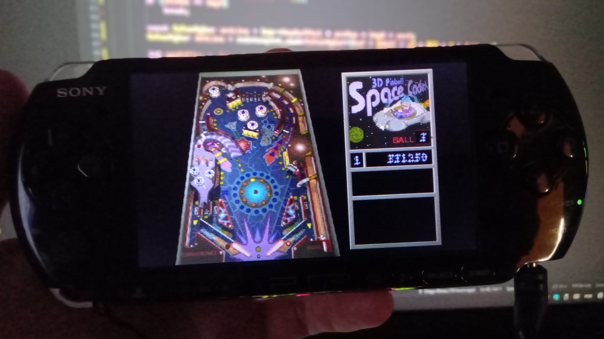
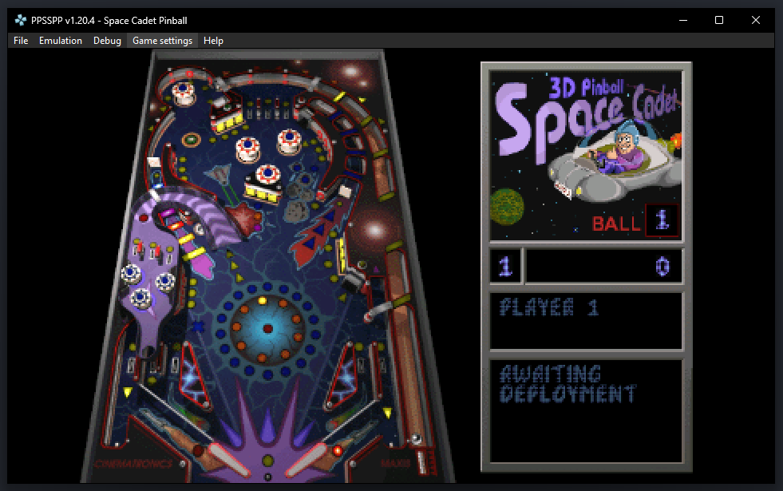

# SpaceCadetPinball - PSP Port

PSP port of [SpaceCadetPinball](https://github.com/kktos/SpaceCadetPinball), a reverse engineering of `3D Pinball for Windows - Space Cadet`.




## Building

### Prerequisites

- [pspdev](https://github.com/pspdev/pspdev) toolchain installed
- Environment variable `PSPDEV` set

```sh
source /usr/local/pspdev/pspdev.sh
```

### Compile

```sh
cd psp-port
./build.sh
```

Output: `psp-port/build/EBOOT.PBP`

## Installation

1. Create folder `ms0:/PSP/GAME/SpaceCadetPinball/` on your PSP
2. Copy `EBOOT.PBP` to that folder
3. Copy `PINBALL.DAT`, sound fx files and `PINBALL.WAV` (game data) to the same folder

## Controls

| Button      | Action                |
| ----------- | --------------------- |
| L Trigger   | Left flipper          |
| R Trigger   | Right flipper         |
| Cross       | Launch ball / Plunger |
| D-Pad Left  | Tilt left             |
| D-Pad Right | Tilt right            |
| D-Pad Up    | Tilt up               |
| Triangle    | Toggle music          |
| Start       | Pause                 |
| Select      | New game              |

## Credits

- **kktos** - Original reverse engineering and SpaceCadetPinball project
- **Diego Bloise** - PSP port
